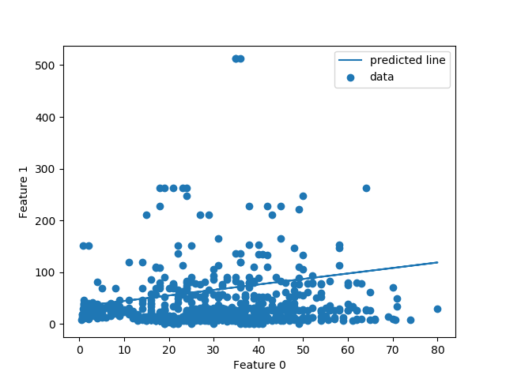

# scikit-LogisticRegression-application
-----------


<!-- Please don't remove this: Grab your social icons from https://github.com/carlsednaoui/gitsocial -->

<!-- display the social media buttons in your README -->

[![alt text][1.1]][1]


<!-- links to social media icons -->
<!-- no need to change these -->

<!-- icons with padding -->

[1.1]: http://i.imgur.com/tXSoThF.png (twitter icon with padding)


<!-- icons without padding -->

[1.2]: http://i.imgur.com/wWzX9uB.png (twitter icon without padding)


<!-- links to your social media accounts -->
<!-- update these accordingly -->

[1]: https://twitter.com/kar_bapon


<!-- Please don't remove this: Grab your social icons from https://github.com/carlsednaoui/gitsocial -->


#### :octocat: Version : 1.0.0
#### :octocat: License :  The GNU General Public License
#### :octocat: Dependence : required additional packages is '[sklearn](https://scikit-learn.org/stable/)'.
which can install by
```
$ pip3 install sklearn
```
A simple and detail applicational analysis of sci kit learn LogisticRegression model .
* Description : In this program uses 'titanic.csv'download link
              (https://sololearn.com/uploads/files/titanic.csv)
              as data source which has
              [Survived,Pclass,Sex,Age,Siblings/Spouces,Parents/Children
              Fare] columns.Survived has two data 1[True] and 0[False].
              It has total 887 row and 7 columns features.
              In this program I am using logisticRegression model
              to train and predict the data.Logisticregression model
              doesnot return just a prediction ,but it returns a probability
              level from 0 to 1.It has following parameters
              [penalty,dual,tol,C,fit_intercept,intercept_scalling,
              class_weight,random_state,solver,max_iter,multi_class,verbose,
              warm-start,n_jobs,l1_ratio].
              My python version is python-3.6.9 and
              Sci-kit learning version-0.20.2

* References : 
- [x] A. C. Muller and S. Guido - Introduction to Machine Learning with Python - 2017
- [x] Hands on Machine Learning with Scikit Learn and Tensorflow
- [x] https://www.sololearn.com
- [x] https://scikit-learn.org/stable/modules/generated/sklearn.linear_model.LogisticRegression.html
- [x] Trevor Hastie,Robert Tibshirani and Jerome FriedmanThe Elements of Statistical Learning Data Mining, Inference, and Prediction

* Output Figure


